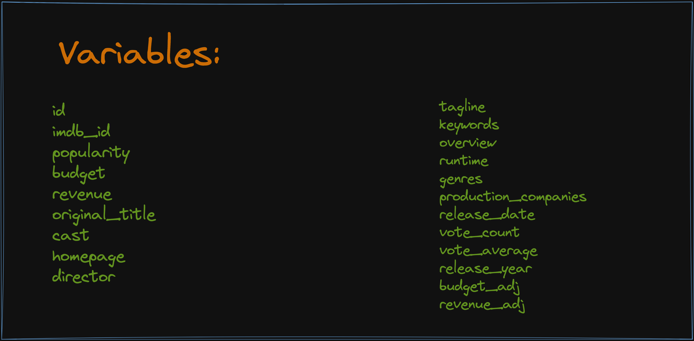
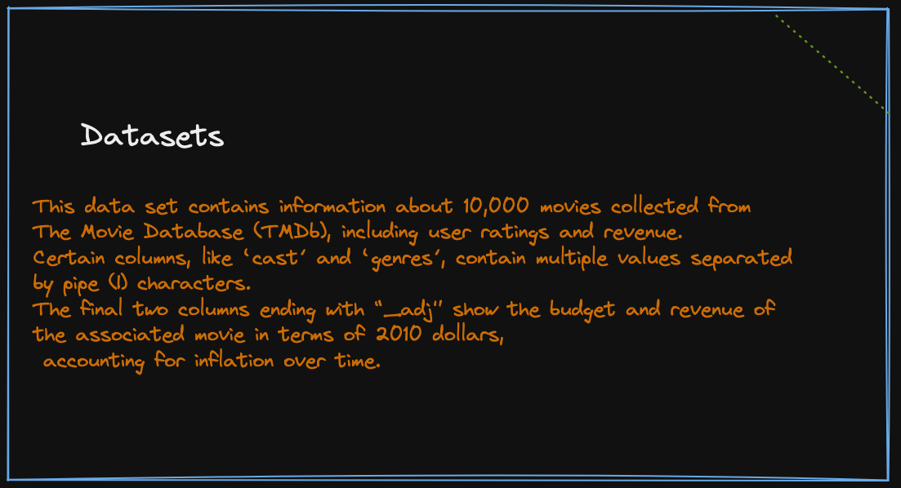

,
,
,
,
,
,

## Conclusions

**Question 1**: from the various scatter plots, we can easily conclude that The Revenue increases with increase in Popularity,That makes Revenue and Popularity are directly proportional. We also visualize the right-biased normal distributions for relationship between Revenue Vs Rating and Popularity Vs Rating.
> Limitations : Here I faced various limitations. Firstly there were many rows within the dataframe which contained a certain amount of null values(a lot to be honest). So, first I had to DORP those rows. Furthermore, the data also contained a duplicated value row (2090), which had to be removed, following a re-check of null values for our key parameters.

**Question 2**: As we can see that 'Avatar' movie Directed by James Cameron earn the highest profit in all, making over 2.5B in profit in this dataset. and 'Star Wars' and 'Titanic' are the most profitable movies. 
> Limitations : Here I faced various limitations. There were no info about the profit of each movie but there was about the revenue and the budget of each movie so I calculated it

**Question 3** from the pie chart and the bar chart we can see 
* Drama is the most popular genre, following by action, comedy and thriller.
* Drame, Comedy, Thriller and Action are four most-made genres.
> Limitations : Here I faced various limitations. The data in the columns of (Directors, genres, production_companies) are sperated by '|', so I needed a function which will take any column as argument from which data is need to be extracted and keep track of count takeing a given column, and separate the string by '|' .

**Question 4** I'm clearly able to list out the top 5 Directors of 2015 based on the mean calculated for the average ratings of various movies released by them in 2015. so, we can conclude that, **'Andrew Jarecki'** with mean average rating of '8.4', wins, then comes 
* 'Don Hertzfeldt' with mean average rating of '8.2'.
* 'Mark Neale' with mean average rating of '8.0'.
* 'Pete Docter' with mean average rating of '8.0'.
* 'Lenny Abrahamson'with mean average rating of '8.0'.
> Limitations : Here I faced various limitations. Firstly there were many rows within the filtered dataframe containing data corresponding to movies
